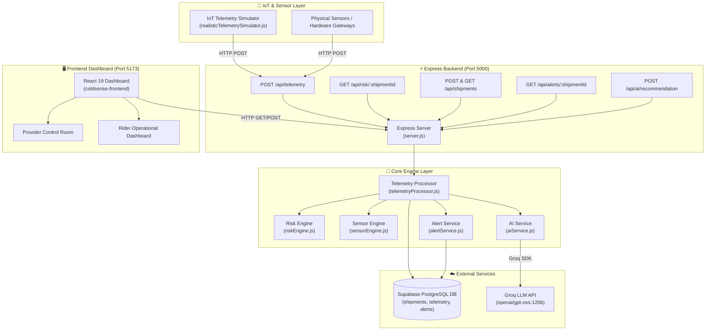

# ColdSense.ai ❄️⚡

> **Intelligent, real-time cold-chain telemetry monitoring and predictive risk engine powered by AI.**

---

## 📌 Problem Statement

Cold-chain supply chains for pharmaceuticals, vaccines, biologics, and high-value perishables face a major vulnerability: **undetected temperature and environmental excursions during transit**. Traditional cold-chain monitoring relies on offline data loggers that are audited *after* cargo arrives, revealing damage only after goods have spoiled. 

Key challenges include:
* **Passive Monitoring**: Standard loggers do not alert operators in real time before critical thresholds are breached.
* **Thermal Decay & Delay**: Temperature breaches happen gradually; without rate-of-change calculation, operators miss early indicators of cooling unit failure.
* **Multi-Factor Risk Ignored**: Door open duration, ambient external weather, humidity spikes, and sensor battery drain interact to accelerate thermal breakdown.
* **Lack of Operator Guidance**: When an anomaly occurs, logistics managers need clear, immediate, actionable mitigation steps rather than raw numbers.

---

## 💡 Our Solution

**ColdSense.ai** is an end-to-end IoT telemetry monitoring platform and AI-driven predictive risk engine designed for cold-chain logistics. ColdSense.ai ingests multi-sensor telemetry streams from delivery vehicles and refrigeration units, calculates thermal rate of change in real time, predicts impending temperature excursions before they occur, manages active alert lifecycles in Supabase, and uses Groq LLM AI to deliver concise, step-by-step mitigation instructions to cold-chain operators.

```
       ┌────────────────────────┐
       │   IoT Sensor Stream    │
       │ (Temp, Humidity, Door) │
       └───────────┬────────────┘
                   │ HTTP POST /api/telemetry
                   ▼
       ┌────────────────────────┐
       │ Express Backend API    │
       └─────┬────────────┬─────┘
             │            │
             ▼            ▼
 ┌───────────────┐    ┌──────────────────────────────────┐
 │ Supabase DB   │    │  Risk Engine & Sensor Engine     │
 │ (PostgreSQL)  │    │  - Rate of Change (°C/min)       │
 └───────────────┘    │  - 15-Min Excursion Prediction   │
                      │  - Multi-Sensor Health Checks    │
                      └────────────────┬─────────────────┘
                                       │
                                       ▼
                      ┌──────────────────────────────────┐
                      │  Groq AI Recommendation Engine   │
                      │  (GPT-OSS 120B Guidance)         │
                      └────────────────┬─────────────────┘
                                       │
                                       ▼
                      ┌──────────────────────────────────┐
                      │  React 19 Frontend Control Room  │
                      └──────────────────────────────────┘
```

---

## ✨ Key Features

1. **Real-Time Multi-Sensor Telemetry Pipeline**: Continuous ingestion of indoor/outdoor temperature, relative humidity, door open status, door open duration, battery voltage level, and GPS location.
2. **Predictive Risk Engine**:
   - Calculates thermal **Rate of Change (°C/min)** across historical telemetry windows.
   - Evaluates a **Base Risk Score (0–100)** based on proximity to safety bounds and thermal drift.
   - Projects **Time-to-Excursion (Minutes)** when temperature is rising and triggers a `predictedExcursion` flag if a breach will occur within 15 minutes.
   - Assigns dynamic status levels: `NORMAL`, `WARNING`, `CRITICAL`, and `EXCURSION`.
3. **Multi-Sensor Health Diagnostics**:
   - **Humidity Monitor**: Validates safe relative humidity bounds (40%–70%) to prevent condensation or desiccation.
   - **Battery Telemetry**: Tracks sensor power levels with progressive alerts at <30%, <15%, and <5%.
   - **Door State Detection**: Differentiates quick access (<30s) from prolonged door open events (≥30s warning, ≥60s critical).
   - **Environmental Differential**: Evaluates indoor vs. outdoor ambient delta (|indoor - outdoor| ≥ 15°C warning).
4. **Automated Alert Lifecycle**:
   - Automatically issues active alerts in Supabase when risk status transitions to `WARNING`, `CRITICAL`, or `EXCURSION`.
   - Prevents duplicate alert spam for ongoing risk levels.
   - Automatically resolves active alerts when telemetry readings return to `NORMAL`.
5. **AI Operator Recommendation Engine**:
   - Integrates with Groq SDK (`openai/gpt-oss-120b`) to evaluate real-time telemetry metrics.
   - Generates 3-part concise guidance: 1) Risk explanation, 2) Immediate action, 3) Fallback plan.
6. **Role-Based Live Dashboard**:
   - **Provider View**: Full control-room dashboard with live monitoring, safety gauges, interactive sparklines, shipment creation, alert history, and AI recommendations.
   - **Rider View**: Mobile-optimized dashboard for transit drivers.

---

## 🌐 Real-World Impact

* **Prevents Pharmaceutical Waste**: Saves critical biopharmaceuticals (vaccines, insulin, blood bags) from thermal destruction.
* **Proactive vs. Reactive**: Gives operators up to a 15-minute window to close doors, adjust refrigeration, or swap backup cooling prior to actual temperature breach.
* **Reduces False Alarms**: Differentiates brief door openings during cargo loading from compressor component failure.

---

## 🏗️ System Architecture

### Mermaid Diagram



---

## 🔄 End-to-End Data Flow

1. **Telemetry Generation**: The IoT simulator or physical sensors capture environmental metrics (`temperature`, `indoorTemperature`, `outdoorTemperature`, `humidity`, `doorOpen`, `doorOpenSeconds`, `batteryLevel`, `shipmentId`).
2. **Ingestion API**: Data is posted to Express at `POST /api/telemetry`.
3. **Database Persistence**: Express inserts raw telemetry into the Supabase `telemetry` PostgreSQL table.
4. **Processing & Analysis**:
   - `telemetryProcessor.js` fetches the last 20 telemetry readings for the shipment.
   - `riskEngine.js` calculates thermal rate of change (°C/min), base risk score, predicted excursion time, and risk status.
   - `sensorEngine.js` calculates non-temperature sensor risks (humidity, battery, door duration, ambient delta).
5. **Alert Management**: `alertService.js` creates or updates an `active` alert in the Supabase `alerts` table if status is `WARNING`, `CRITICAL`, or `EXCURSION`, or auto-resolves alerts if `NORMAL`.
6. **AI Assessment**: If risk is elevated, `aiService.js` constructs a prompt with telemetry metrics and calls the Groq SDK (`openai/gpt-oss-120b`) for actionable instructions.
7. **Dashboard Streaming**: The React frontend polls `GET /api/risk/:shipmentId` every 5 seconds to update safety gauges, sparkline graphs, active alerts, and AI recommendation panels.

---

## 💻 Technology Stack

### Backend
* **Runtime**: Node.js (v18+)
* **Framework**: Express.js (v5)
* **Database Client**: `@supabase/supabase-js` (v2)
* **AI SDK**: `groq-sdk` (v1)
* **HTTP Client**: `axios`
* **Utilities**: `dotenv`, `cors`, `nodemon`

### Frontend
* **Framework**: React 19 + Vite 8
* **Icons**: `lucide-react`
* **Database Client**: `@supabase/supabase-js`
* **Styling**: Modern CSS modular design system (`styles.css`, `api.css`, `product.css`, `modern.css`)

### Database & Auth
* **Database**: Supabase (PostgreSQL with RLS policies)
* **Authentication**: Supabase Auth (Email/Password with Provider & Rider role metadata)

---

## 📁 Project Folder Structure

```
coldsense-ai/
├── BACKEND/                          # Express.js Backend Service
│   ├── src/
│   │   ├── config/
│   │   │   └── supabase.js           # Supabase client initialization
│   │   ├── routes/
│   │   │   ├── aiRoutes.js           # Direct AI recommendation route
│   │   │   ├── alertRoutes.js        # Alert history endpoints
│   │   │   ├── riskRoutes.js         # Core risk analysis endpoint
│   │   │   ├── shipmentRoutes.js     # Shipment CRUD & location endpoints
│   │   │   └── telemetryRoutes.js    # Telemetry ingestion endpoint
│   │   ├── services/
│   │   │   ├── aiService.js          # Groq LLM integration
│   │   │   ├── alertService.js       # Alert lifecycle management
│   │   │   ├── realisticTelemetrySimulator.js # Multi-scenario simulator engine
│   │   │   ├── riskEngine.js         # Thermal risk & excursion predictor
│   │   │   ├── sensorEngine.js       # Multi-sensor health diagnostics
│   │   │   ├── telemetryProcessor.js # Orchestration layer for telemetry
│   │   │   └── telemetrySimulator.js # Standard telemetry loop simulator
│   │   ├── server.js                 # Express application entry point
│   │   ├── simulator.js              # Dedicated IoT simulator launcher
│   │   ├── testProcessor.js          # Standalone test runner for processor
│   │   └── testSensorEngine.js       # Standalone test runner for sensor engine
│   ├── supabase/
│   │   └── migrations/
│   │       ├── 20261004_add_product_type.sql   # Product category schema update
│   │       └── 20261004_add_sensor_fields.sql # Multi-sensor schema update
│   ├── .env                          # Backend environment variables
│   ├── .env.example                  # Environment template for backend
│   └── package.json                  # Backend dependencies and scripts
│
├── FRONTEND/                         # React 19 + Vite Dashboard
│   ├── src/
│   │   ├── components/               # React UI components
│   │   │   ├── AiAssistant.jsx       # Floating AI chat widget
│   │   │   ├── AuthGate.jsx          # Role-based route guard
│   │   │   ├── AuthScreenV2.jsx      # Provider/Rider sign-in screen
│   │   │   ├── EmbeddedLocationMap.jsx # Interactive location visualizer
│   │   │   ├── Header.jsx            # Top navigation bar
│   │   │   ├── LocationCard.jsx      # Shipment origin/destination card
│   │   │   ├── LocationExperience.jsx# Map & route tracking experience
│   │   │   ├── MetricCard.jsx        # Summary metric display
│   │   │   ├── ProfileMenu.jsx       # User avatar & sign-out menu
│   │   │   ├── RiderOperationalDashboard.jsx # Driver operational UI
│   │   │   ├── RiskRing.jsx          # Circular risk gauge component
│   │   │   └── TemperatureChart.jsx  # Telemetry timeline graph
│   │   ├── services/
│   │   │   ├── api.js                # Frontend API client
│   │   │   ├── location.js           # Geolocation helpers
│   │   │   └── supabase.js           # Supabase auth & client setup
│   │   ├── ApiApp.jsx                # Main provider workspace dashboard
│   │   ├── App.tsx                   # Top-level React container
│   │   ├── main.tsx                  # Application mount point with error guard
│   │   └── styles.css                # Primary workspace styling
│   ├── index.html                    # HTML document shell
│   ├── .env                          # Frontend environment variables
│   ├── .env.example                  # Environment template for frontend
│   ├── vite.config.js                # Vite build configuration
│   └── package.json                  # Frontend dependencies and scripts
│
└── README.md                         # Project documentation
```

---

## 📋 Prerequisites

Before running ColdSense.ai, ensure you have installed:
* **Node.js**: v18.0.0 or higher
* **npm**: v9.0.0 or higher
* **Supabase Account**: A free Supabase project with database access
* **Groq API Key**: A valid Groq API key for AI recommendation generation (free at [console.groq.com](https://console.groq.com))

---

## ⚙️ Environment Variables

### Backend (`BACKEND/.env`)

Create `BACKEND/.env` using `BACKEND/.env.example` as a template:

```env
SUPABASE_URL=https://your-project.supabase.co
SUPABASE_ANON_KEY=your-supabase-anon-key
PORT=5000
GROQ_API_KEY=gsk_your_groq_api_key_here

# Optional Simulator Configuration
SIMULATOR_API_URL=http://localhost:5000/api/telemetry
SIMULATOR_SHIPMENT_IDS=SHP001
SIMULATOR_INTERVAL_MS=10000
SIMULATOR_SCENARIO=AUTO
```

### Frontend (`FRONTEND/.env`)

Create `FRONTEND/.env` using `FRONTEND/.env.example` as a template:

```env
VITE_API_URL=http://localhost:5000/api
VITE_SUPABASE_URL=https://your-project.supabase.co
VITE_SUPABASE_ANON_KEY=your-supabase-anon-key
VITE_DEMO_RIDER_CODE=12345
```

> ⚠️ **Security Warning**: Never commit real API keys or secrets to public repositories.

---

## 🗄️ Database Setup (Supabase)

Execute the following SQL statements in your Supabase **SQL Editor** to create the required tables and schema migrations:

```sql
-- 1. Create Shipments Table
CREATE TABLE IF NOT EXISTS public.shipments (
    shipment_id TEXT PRIMARY KEY,
    product_name TEXT NOT NULL,
    product_type TEXT DEFAULT 'OTHER' NOT NULL,
    origin TEXT,
    destination TEXT,
    min_temperature DOUBLE PRECISION NOT NULL,
    max_temperature DOUBLE PRECISION NOT NULL,
    created_at TIMESTAMP WITH TIME ZONE DEFAULT timezone('utc'::text, now()) NOT NULL
);

-- 2. Create Telemetry Table
CREATE TABLE IF NOT EXISTS public.telemetry (
    id BIGINT GENERATED BY DEFAULT AS IDENTITY PRIMARY KEY,
    shipment_id TEXT NOT NULL REFERENCES public.shipments(shipment_id) ON DELETE CASCADE,
    temperature DOUBLE PRECISION NOT NULL,
    humidity DOUBLE PRECISION,
    indoor_temperature DOUBLE PRECISION,
    outdoor_temperature DOUBLE PRECISION,
    door_open BOOLEAN DEFAULT false,
    door_open_seconds INTEGER DEFAULT 0,
    battery_level DOUBLE PRECISION,
    latitude DOUBLE PRECISION,
    longitude DOUBLE PRECISION,
    recorded_at TIMESTAMP WITH TIME ZONE DEFAULT timezone('utc'::text, now()) NOT NULL
);

-- Index telemetry for fast querying
CREATE INDEX IF NOT EXISTS idx_telemetry_shipment_time 
ON public.telemetry(shipment_id, recorded_at DESC);

-- 3. Create Alerts Table
CREATE TABLE IF NOT EXISTS public.alerts (
    id BIGINT GENERATED BY DEFAULT AS IDENTITY PRIMARY KEY,
    shipment_id TEXT NOT NULL REFERENCES public.shipments(shipment_id) ON DELETE CASCADE,
    risk_level TEXT NOT NULL,
    message TEXT NOT NULL,
    predicted_minutes DOUBLE PRECISION,
    status TEXT DEFAULT 'active' NOT NULL,
    created_at TIMESTAMP WITH TIME ZONE DEFAULT timezone('utc'::text, now()) NOT NULL,
    resolved_at TIMESTAMP WITH TIME ZONE
);

-- 4. Initial Seed Data (Sample Shipment)
INSERT INTO public.shipments (shipment_id, product_name, product_type, origin, destination, min_temperature, max_temperature)
VALUES ('SHP001', 'COVID-19 Vaccines', 'VACCINE', 'Mumbai Logistics Hub', 'Delhi Central Storage', 2.0, 8.0)
ON CONFLICT (shipment_id) DO NOTHING;
```

---

## 🚀 Quick Start Guide

Follow these exact steps to run the complete ColdSense.ai stack locally.

### Step 1: Install Dependencies

```bash
# Terminal 1 - Backend Dependencies
cd BACKEND
npm install

# Terminal 2 - Frontend Dependencies
cd ../FRONTEND
npm install
```

### Step 2: Start the Express Backend

```bash
cd BACKEND
npm run dev
```
*The server will start on `http://localhost:5000`.*

### Step 3: Run the IoT Telemetry Simulator

Open a new terminal window:

```bash
cd BACKEND
node src/simulator.js
```
*The simulator will start transmitting simulated sensor payloads for shipment `SHP001` every 10 seconds.*

### Step 4: Start the Frontend Dashboard

Open a new terminal window:

```bash
cd FRONTEND
npm run dev
```
*The frontend dashboard will be available at `http://localhost:5173`.*

---

## 📡 API Reference

### 1. Ingest Sensor Telemetry
* **Method**: `POST`
* **Endpoint**: `/api/telemetry`
* **Purpose**: Records incoming sensor metrics and triggers telemetry processing.
* **Request Body**:
```json
{
  "shipmentId": "SHP001",
  "temperature": 5.4,
  "indoorTemperature": 5.4,
  "outdoorTemperature": 31.2,
  "humidity": 58.0,
  "doorOpen": false,
  "doorOpenSeconds": 0,
  "batteryLevel": 96.0
}
```
* **Success Response (`201 Created`)**:
```json
{
  "message": "Telemetry processed successfully",
  "telemetry": {
    "id": 101,
    "shipment_id": "SHP001",
    "temperature": 5.4,
    "recorded_at": "2026-10-04T21:00:00.000Z"
  },
  "processing": {
    "shipmentId": "SHP001",
    "risk": {
      "currentTemperature": 5.4,
      "trend": "STABLE",
      "rateOfChange": 0,
      "riskScore": 26,
      "status": "NORMAL",
      "predictedExcursion": false,
      "predictedMinutes": null
    },
    "alert": null,
    "recommendation": null
  }
}
```

---

### 2. Fetch Risk Analysis & AI Recommendation
* **Method**: `GET`
* **Endpoint**: `/api/risk/:shipmentId`
* **Purpose**: Computes real-time thermal risk, multi-sensor analysis, alert status, and calls AI recommendation if risk is elevated.
* **Example Request**: `GET /api/risk/SHP001`
* **Response (`200 OK`)**:
```json
{
  "shipment": {
    "shipmentId": "SHP001",
    "productName": "COVID-19 Vaccines",
    "productType": "VACCINE",
    "origin": "Mumbai Logistics Hub",
    "destination": "Delhi Central Storage"
  },
  "safeRange": { "min": 2, "max": 8 },
  "telemetry": {
    "readingsAnalyzed": 20,
    "latestTemperature": 7.8,
    "latestHumidity": 64,
    "latestReadingAt": "2026-10-04T21:05:00.000Z",
    "history": [
      { "temperature": 5.4, "humidity": 58, "recordedAt": "2026-10-04T21:00:00.000Z" },
      { "temperature": 7.8, "humidity": 64, "recordedAt": "2026-10-04T21:05:00.000Z" }
    ]
  },
  "sensors": {
    "indoorTemperature": 7.8,
    "outdoorTemperature": 32.5,
    "humidity": 64,
    "doorOpen": true,
    "doorOpenSeconds": 45,
    "batteryLevel": 92,
    "analysis": {
      "overallStatus": "WARNING",
      "door": { "status": "WARNING", "score": 35, "message": "Door has remained open for 45 seconds" }
    }
  },
  "risk": {
    "currentTemperature": 7.8,
    "trend": "RISING",
    "rateOfChange": 0.48,
    "riskScore": 78,
    "status": "CRITICAL",
    "predictedExcursion": true,
    "predictedMinutes": 0.4
  },
  "alert": {
    "id": 12,
    "shipment_id": "SHP001",
    "risk_level": "CRITICAL",
    "status": "active"
  },
  "recommendation": "1. Risk: Rapid temperature rise due to open storage door nearing the 8°C ceiling.\n2. Action: Immediately seal the container door and verify cooling unit power.\n3. Fallback: Transfer vaccine crates to backup cold store if temperature exceeds 8°C."
}
```

---

### 3. Create Shipment
* **Method**: `POST`
* **Endpoint**: `/api/shipments`
* **Request Body**:
```json
{
  "shipmentId": "SHP004",
  "productName": "Insulin Batches",
  "productType": "MEDICINE",
  "origin": "Bangalore Depot",
  "destination": "Hyderabad Hospital",
  "minTemperature": 2.0,
  "maxTemperature": 8.0
}
```

---

### 4. List All Shipments
* **Method**: `GET`
* **Endpoint**: `/api/shipments`
* **Response (`200 OK`)**:
```json
{
  "count": 1,
  "shipments": [
    {
      "shipment_id": "SHP001",
      "product_name": "COVID-19 Vaccines",
      "product_type": "VACCINE",
      "min_temperature": 2,
      "max_temperature": 8
    }
  ]
}
```

---

### 5. Fetch Shipment Alerts
* **Method**: `GET`
* **Endpoint**: `/api/alerts/:shipmentId`
* **Response (`200 OK`)**:
```json
{
  "shipmentId": "SHP001",
  "count": 1,
  "alerts": [
    {
      "id": 12,
      "shipment_id": "SHP001",
      "risk_level": "CRITICAL",
      "message": "Temperature is rising rapidly. Upper limit may be crossed in approximately 0.4 minutes.",
      "status": "active",
      "created_at": "2026-10-04T21:05:00.000Z"
    }
  ]
}
```

---

### 6. Direct AI Recommendation Endpoint
* **Method**: `POST`
* **Endpoint**: `/api/ai/recommendation`
* **Request Body**:
```json
{
  "shipmentId": "SHP001",
  "productName": "COVID-19 Vaccines",
  "currentTemperature": 7.8,
  "minTemperature": 2.0,
  "maxTemperature": 8.0,
  "trend": "RISING",
  "rateOfChange": 0.48,
  "riskScore": 78,
  "status": "CRITICAL",
  "predictedMinutes": 0.4
}
```

---

## 🧮 Risk & Sensor Calculation Logic

### 1. Temperature Risk Engine (`riskEngine.js`)

$$\text{Rate of Change } (\text{°C/min}) = \frac{T_{\text{current}} - T_{\text{previous}}}{\Delta t_{\text{minutes}}}$$

* **Trend Classification**:
  * `RISING` if $\text{Rate of Change} > 0.01$ °C/min
  * `FALLING` if $\text{Rate of Change} < -0.01$ °C/min
  * `STABLE` otherwise
* **Base Risk Score Calculation**:
  * If $T_{\text{current}} < T_{\text{min}}$ or $T_{\text{current}} > T_{\text{max}}$, $\text{RiskScore} = 100$.
  * Otherwise, $\text{UpperRisk} = 1 - \frac{T_{\text{max}} - T_{\text{current}}}{T_{\text{max}} - T_{\text{min}}}$, and $\text{BaseScore} = \max(0, \text{UpperRisk} \times 60)$.
  * If $\text{Trend} = \text{RISING}$, add $+20$ points.
* **Predictive Excursion Window**:
  $$\text{Predicted Minutes} = \frac{T_{\text{max}} - T_{\text{current}}}{\text{Rate of Change}}$$
  * If $\text{Predicted Minutes} \le 15$, set `predictedExcursion = true` and add $+20$ points.
* **Risk Score & Status Scale (Clamped 0–100)**:
  * `EXCURSION`: $T_{\text{current}} < T_{\text{min}}$ OR $T_{\text{current}} > T_{\text{max}}$ (Risk Score = 100)
  * `CRITICAL`: Risk Score $\ge 75$
  * `WARNING`: Risk Score $\ge 40$
  * `NORMAL`: Risk Score $< 40$

### 2. Multi-Sensor Diagnostics (`sensorEngine.js`)

* **Humidity Risk**: Safe range 40%–70%. Deviations $\ge 15\%$ trigger `CRITICAL` (Score 80).
* **Battery Telemetry**: Healthy $>30\%$. Warning between $15\%\text{--}30\%$. Critical $<15\%$.
* **Door State Risk**: $<30\text{s}$ normal (Score 5); $30\text{--}59\text{s}$ warning (Score 35); $\ge 60\text{s}$ critical (Score 65–90).
* **Environmental Delta**: Warns when $|T_{\text{outdoor}} - T_{\text{indoor}}| \ge 15^\circ\text{C}$.

---

## 🤖 AI Recommendation Flow

When the Risk Engine classifies a shipment in `WARNING`, `CRITICAL`, or `EXCURSION` status, `aiService.js` constructs a structured operational context payload and invokes the **Groq LLM API** (`openai/gpt-oss-120b`).

```
  [Telemetry Event] ──► [Risk Engine Status ≥ WARNING]
                               │
                               ▼
            ┌──────────────────────────────────────┐
            │ Construct Structured Groq Prompt:    │
            │ - Product Name & Limits (2°C - 8°C)  │
            │ - Current Temp & Rate of Change      │
            │ - Risk Score & Predicted Minutes     │
            └──────────────────┬───────────────────┘
                               │
                               ▼
            ┌──────────────────────────────────────┐
            │ Groq SDK Completion Request          │
            │ Model: "openai/gpt-oss-120b"         │
            │ Temperature: 0.2                     │
            └──────────────────┬───────────────────┘
                               │
                               ▼
            ┌──────────────────────────────────────┐
            │ Response Delivered to Control Room:  │
            │ 1. Risk Explanation                  │
            │ 2. Immediate Required Action         │
            │ 3. Secondary Contingency Plan        │
            └──────────────────────────────────────┘
```

---

## 🎭 Demo Scenario & Expected Behavior

The included simulator (`realisticTelemetrySimulator.js`) automatically executes a realistic 72-tick state machine:

| Stage | Scenario | Telemetry Behavior | Expected Risk Status | Dashboard Action |
|---|---|---|---|---|
| **Phase 1** | `NORMAL` | Temp 5.4°C, Door Closed, Humidity ~58% | `NORMAL` | Green safety gauge, all clear status |
| **Phase 2** | `DOOR_OPEN` | Door opens for >30s, Humidity rises to 65% | `WARNING` | Sensor warning badge, door alert |
| **Phase 3** | `WARMING` | Temp rises at +0.10°C/min towards 7.8°C | `WARNING` / `CRITICAL` | Rate-of-change spike, predictive excursion warning |
| **Phase 4** | `EXCURSION` | Temp crosses 8.1°C threshold | `EXCURSION` | Red gauge, active alert created, **Groq AI Recommendation generated** |
| **Phase 5** | `RECOVERY` | Refrigeration cooling drops temp back to 5.2°C | `NORMAL` | Active alerts **automatically resolved**, status reset to normal |

---

## 🧪 Example API Commands (`curl`)

### 1. Ingest Telemetry

```bash
curl -X POST http://localhost:5000/api/telemetry \
  -H "Content-Type: application/json" \
  -d '{
    "shipmentId": "SHP001",
    "temperature": 7.6,
    "indoorTemperature": 7.6,
    "outdoorTemperature": 32.0,
    "humidity": 68.0,
    "doorOpen": true,
    "doorOpenSeconds": 45,
    "batteryLevel": 88.0
  }'
```

### 2. Query Live Risk Analysis

```bash
curl http://localhost:5000/api/risk/SHP001
```

### 3. Create a New Shipment

```bash
curl -X POST http://localhost:5000/api/shipments \
  -H "Content-Type: application/json" \
  -d '{
    "shipmentId": "SHP005",
    "productName": "Blood Samples",
    "productType": "BLOOD_SAMPLE",
    "origin": "City Clinic",
    "destination": "Central Lab",
    "minTemperature": 2.0,
    "maxTemperature": 6.0
  }'
```

---

## 🔧 Troubleshooting & Common Errors

| Error | Cause | Resolution |
|---|---|---|
| `Failed to save telemetry / Database error` | Missing or invalid `SUPABASE_URL` / `SUPABASE_ANON_KEY` in `BACKEND/.env` | Verify Supabase credentials and ensure database migrations have been executed. |
| `Shipment SHP001 not found (404)` | Telemetry sent for a shipment ID that does not exist in `shipments` table | Create the shipment first via `POST /api/shipments` or run the database SQL seed script. |
| `AI recommendation failed / Groq API error` | Invalid or missing `GROQ_API_KEY` in `BACKEND/.env` | Obtain a valid key from [console.groq.com](https://console.groq.com) and restart the backend. |
| `CORS Error in Browser` | Frontend calling wrong port or CORS headers blocked | Confirm `VITE_API_URL` is set to `http://localhost:5000/api` in `FRONTEND/.env`. |
| `Live dashboard paused / Render error` | Frontend backend disconnected or invalid response payload | Click "Reload dashboard" or check backend console logs. |

---

## 🔒 Security Notes

* **Environment Isolation**: Secret keys (`GROQ_API_KEY`) are kept strictly on the backend.
* **Row Level Security (RLS)**: Supabase PostgreSQL tables support RLS policies for multi-tenant data safety.
* **Bearer Token Support**: Backend API endpoints accept JWT tokens passed from Supabase Auth sessions.

---

## 🚀 Future Enhancements

* **Hardware Microcontroller Gateways**: Native firmware for ESP32 / Nordic nRF9160 LTE-M cellular trackers.
* **Automated Dispatch Integration**: Integration with Twilio SMS and WhatsApp Business API for instant driver alerting.
* **Edge AI Risk Evaluation**: On-device MicroTensor models for localized risk evaluation during offline network blackouts.

---

## 👥 Demo Information

* **Demo Rider Code**: `12345`
* **Default Demo Shipment**: `SHP001` (COVID-19 Vaccines)
* **Demo Preset Scenarios**: `SHP001` auto-cycles through Normal, Door Open, Warming, Excursion, and Recovery.
